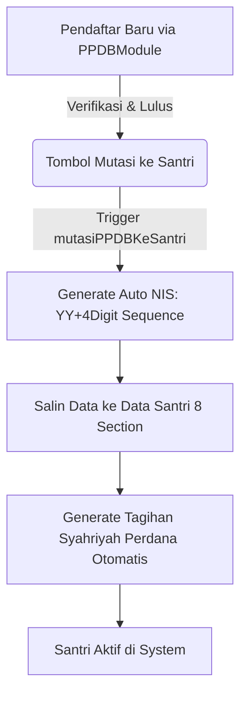
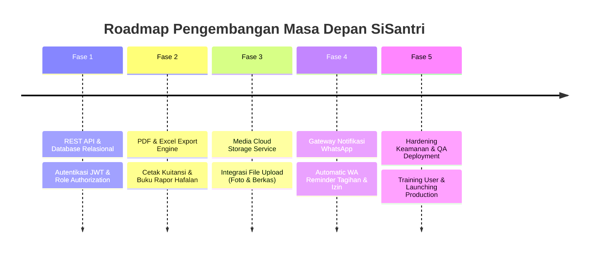

# LAPORAN ANALISIS SISTEM & FLOW LOGIC SIAP
## Sistem Informasi Administrasi Pesantren Mukhtar Syafaat Blokagung

---

| Parameter | Keterangan |
|---|---|
| **Nama Aplikasi** | **SIAP** (Sistem Informasi Administrasi Pesantren) & Portal E-Santri |
| **Versi Frontend** | v1.1.0 (SPA Multi-URL Routing) |
| **Teknologi Utama** | React 19, TypeScript, Vite, Tailwind CSS, Lucide Icons, React Router DOM |
| **Dokumen Acuan** | [prd.md](file:///d:/web/sisantri---sim-pesantren-mukhtar-syafaat/prd.md) & `RENCANA APLIKASI.xlsx` |
| **Tanggal Laporan** | 21 Agustus 2026 |

---

## 1. PENDAHULUAN & RINGKASAN EKSEKUTIF

**SIAP** adalah Sistem Informasi Manajemen Pesantren terpadu yang dirancang untuk mengintegrasikan seluruh operasional Pondok Pesantren Mukhtar Syafaat Blokagung, Banyuwangi. 

Sistem ini memfasilitasi integrasi data dari berbagai unit pendidikan (pesantren, asrama, madrasah diniyah/madin, sekolah formal MTs/MA/SMK, tahfidz Al-Qur'an, nadhoman kitab), kepengasuhan santri (kesehatan UKS, perizinan, konseling, kunjungan), kepegawaian, keuangan (syahriyah/biaya tahunan), PPDB (Penerimaan Peserta Didik Baru), hingga Portal Monitoring Real-time bagi Wali Santri.

Secara umum, aplikasi frontend telah diimplementasikan dengan sangat rapi berbasis **React + TypeScript + Context API**, lengkap dengan *persistent state management* berbasis `localStorage` untuk mematangkan seluruh alur logika (logic flow) bisnis sebelum dihubungkan ke backend REST API.

---

## 2. STRUKTUR FILE & ARSITEKTUR KODE

Berikut adalah pemetaan struktur berkas proyek pada direktori `src/`:

```
src/
├── App.tsx                     # Container utama, routing tab aktif, sidebar collapse, & modal login
├── main.tsx                    # Entry point aplikasi React DOM
├── index.css                   # Import Tailwind CSS & style dasar
├── types/
│   └── sisantri.ts             # Definisi interface TypeScript lengkap (Santri 8 Form, Tahfidz, Keuangan, PPDB, dll)
├── context/
│   └── AppContext.tsx          # Centralized State Store & Business Logic Handler (useLocalStorage)
├── data/
│   └── mockData.ts             # Initial mock data realistis (Banyuwangi & Mukhtar Syafaat context)
└── components/
    ├── layout/
    │   ├── Header.tsx          # Baris navigasi atas (user status, notifikasi, switch role)
    │   └── Sidebar.tsx         # Navigasi samping bertingkat (Modul 1-8 & Portal Wali)
    ├── auth/
    │   └── LoginModal.tsx      # Modal pengubah role/persona user (RBAC Simulator)
    ├── landing/
    │   └── LandingPage.tsx     # Portal publik profil pesantren & informasi pendaftaran
    ├── dashboard/
    │   └── DashboardModule.tsx # Executive dashboard (statistik santri, keuangan, perizinan, tahfidz)
    ├── kesantrian/
    │   ├── SubPesantren.tsx    # Master Data Unit Pesantren, Asrama, dan Kamar
    │   ├── SubMadin.tsx        # Master Data Marhalah Madin, Kelas Madin, Kitab Nadhoman (Dependent Filter)
    │   ├── SubSekolah.tsx      # Master Data Unit Sekolah Formal (MTs, MA, SMK), Jurusan, Kelas
    │   ├── DataSantriModule.tsx# Formulir 8 Section Data Santri lengkap & Auto NIS Generator
    │   ├── TahfidzModule.tsx   # Panel setoran Tahfidz Al-Qur'an & pendaftaran peserta tahfidz
    │   ├── NadhomanModule.tsx  # Panel setoran Nadhoman kitab & akumulasi bait otomatis
    │   └── AlumniModule.tsx    # Database santri non-aktif / lulusan
    ├── kepengasuhan/
    │   └── KepengasuhanModule.tsx # Sub-modul Kesehatan (UKS), Perizinan Santri, Konseling & Kunjungan
    ├── kepegawaian/
    │   └── KepegawaianModule.tsx # Data Jabatan & Data Pegawai (Aktif/Non-Aktif)
    ├── akademik/
    │   └── AkademikModule.tsx  # Presensi Formal & Madin per kelas/tanggal
    ├── keuangan/
    │   └── KeuanganModule.tsx  # Biaya Master, Tagihan Syahriyah, Transaksi Pembayaran & Kuitansi
    ├── ppdb/
    │   └── PPDBModule.tsx      # Pendaftaran Santri Baru & Mutasi 1-Click ke Data Santri Aktif
    ├── wali/
    │   └── PortalWaliModule.tsx# Portal Monitoring Khusus Wali Santri (Capaian Hafalan, Syahriyah, Kesehatan)
    └── settings/
        ├── SettingsModule.tsx  # Konfigurasi Hak Akses RBAC & Simulator Peran
        └── TahunAjaranModule.tsx # Manajemen Tahun Ajaran Aktif
```

---

## 3. RANGKUMAN FLOW LOGIC SYSTEM

Seluruh *business logic* dikelola secara terpusat pada file [AppContext.tsx](file:///d:/web/sisantri---sim-pesantren-mukhtar-syafaat/src/context/AppContext.tsx). Berikut alur logika utama pada setiap modul:



### 3.1 Alur Penerimaan Santri Baru (PPDB) & Mutasi NIS Otomatis
1. **Pendaftaran**: Data calon santri diinput via [PPDBModule.tsx](file:///d:/web/sisantri---sim-pesantren-mukhtar-syafaat/src/components/ppdb/PPDBModule.tsx) dengan memilih unit pesantren, unit sekolah, dan marhalah madin tujuan.
2. **Generasi NIS Otomatis**: Fungsi `generateNextNIS()` pada [AppContext.tsx](file:///d:/web/sisantri---sim-pesantren-mukhtar-syafaat/src/context/AppContext.tsx#L260-L270) secara otomatis mengambil 2 digit terakhir tahun berjalan (misal: `26`) ditambah 4 digit urutan pendaftaran (misal: `260001`).
3. **Mutasi 1-Click (`mutasiPPDBKeSantri`)**: Saat pendaftar disetujui, sistem membuat record baru pada `santriList`, menetapkan asrama dan kamar default, dan **secara otomatis membuat Tagihan Syahriyah bulan berjalan** agar santri langsung terdaftar di sistem keuangan. Status PPDB diubah menjadi `'Telah Dimutasi'`.

### 3.2 Alur Pendataan Santri (8 Section Form) & Transisi Alumni
1. Formulir [DataSantriModule.tsx](file:///d:/web/sisantri---sim-pesantren-mukhtar-syafaat/src/components/kesantrian/DataSantriModule.tsx) mengimplementasikan 8 Bagian Data sesuai spesifikasi PRD & Excel:
   - **Section A**: Keterangan Santri (NIK, NISN, Nama, Gender, TTL, Status Keluarga, Saudara di Pesantren).
   - **Section B**: Keterangan Tempat Tinggal (RT/RW, Dusun, Desa, Kecamatan, Kabupaten, Provinsi).
   - **Section C**: Keterangan Kesehatan (Golongan Darah, Riwayat Penyakit, Tindakan, Kondisi).
   - **Section D**: Keterangan Pendidikan (*Dependent Dropdown* terintegrasi ke Master Pesantren, Madin, dan Sekolah).
   - **Section E**: Riwayat Pendidikan (Sekolah Asal, Tahun Lulus, No KIP).
   - **Section F**: Data Orang Tua / Wali (NIK, Nama, Pekerjaan, Penghasilan, No HP).
   - **Section G**: Santri Asuh (Status Asuh 1/2/3 & Alasan).
   - **Section H**: Keterangan Keluar / Alumni (Alasan Keluar, Tahun Keluar, No HP Alumni).
2. **Otomatisasi Status Alumni**: Apabila Bagian H (alasan/tahun keluar) diisi, fungsi `addSantri` atau `updateSantri` di [AppContext.tsx](file:///d:/web/sisantri---sim-pesantren-mukhtar-syafaat/src/context/AppContext.tsx#L455-L460) secara otomatis mengubah status santri dari `'Aktif'` menjadi `'Alumni'`, sehingga data santri tersebut langsung muncul pada [AlumniModule.tsx](file:///d:/web/sisantri---sim-pesantren-mukhtar-syafaat/src/components/kesantrian/AlumniModule.tsx).

### 3.3 Alur Hafalan Tahfidz Al-Qur'an & Setoran Nadhoman Kitab
1. **Tahfidz Al-Qur'an**:
   - Terdiri dari 2 panel (Form Setoran + Tabel Histori dan Modal Cari Santri).
   - Admin dapat mendaftarkan santri via fitur **"Input Peserta Tahfidz"**.
   - Input setoran mencatat Tanggal, Juz (1-30), Surah, Rentang Ayat, Jenis Setoran (Ziyadah/Murojaah), Nilai (A/B/C), dan Pengampu.
2. **Setoran Nadhoman Kitab**:
   - Mencatat hafalan kitab syair agama (seperti *Aqidatul Awam*, *Imriti*, *Alfiyah Ibn Malik*).
   - **Kalkulasi Akumulasi Otomatis**: Fungsi `addSetoranNadhoman` pada [AppContext.tsx](file:///d:/web/sisantri---sim-pesantren-mukhtar-syafaat/src/context/AppContext.tsx#L478-L497) mengambil total hafalan sebelumnya untuk kitab yang sama pada santri tersebut, lalu menjumlahkannya dengan `jumlahBaitBaru` untuk menghasilkan `totalHafalanSelesai` secara real-time.

### 3.4 Alur Keuangan, Syahriyah & Pembayaran
1. **Master Biaya & Tagihan**: Mengelola Biaya Tahunan, Syahriyah (Bulanan), dan Non-Syahriyah.
2. **Pembayaran & Generasi Kuitansi**:
   - Melalui [KeuanganModule.tsx](file:///d:/web/sisantri---sim-pesantren-mukhtar-syafaat/src/components/keuangan/KeuanganModule.tsx), admin input nominal pembayaran dan metode (Tunai/Transfer/E-Wallet).
   - Fungsi `addBayarTagihan` membuat nomor kuitansi otomatis dengan format `KW-YYYYMMDD-XXX`.
   - Menghitung `nominalTerbayar`. Jika `nominalTerbayar >= nominalTagihan`, status tagihan otomatis menjadi `'Lunas'`, jika sebagian menjadi `'Sebagian'`.

### 3.5 Alur Kepengasuhan (Kesehatan, Perizinan, Konseling)
1. **Kesehatan UKS**: Pencatatan keluhan, diagnosa, obat, dan status santri (`Dalam Perawatan UKS`, `Sembuh`, `Dirujuk Rumah Sakit`).
2. **Perizinan Santri**: Pengajuan perizinan keluar/pulang dengan status persetujuan (`Menunggu Persetujuan`, `Disetujui`, `Ditolak`) beserta pencatatan nama pengasuh yang menyetujui.
3. **Konseling & Kunjungan**: Log bimbingan konseling/pelanggaran dan pencatatan kunjungan wali santri di pos pengamanan.

### 3.6 Alur Portal Wali Santri & RBAC
1. **Portal Wali Santri** ([PortalWaliModule.tsx](file:///d:/web/sisantri---sim-pesantren-mukhtar-syafaat/src/components/wali/PortalWaliModule.tsx)): Ringkasan transparan bagi orang tua untuk memantau perkembangan hafalan ananda, status tunggakan/pelunasan Syahriyah, riwayat kesehatan, dan perizinan.
2. **Role-Based Access Control (RBAC)** ([SettingsModule.tsx](file:///d:/web/sisantri---sim-pesantren-mukhtar-syafaat/src/components/settings/SettingsModule.tsx)): Menyediakan 9 level peran (Admin Sistem, Admin Pesantren, Admin Madin, Admin Sekolah, Admin Kepengasuhan, Bendahara, Pimpinan, Guru, Wali Santri) dengan simulator pergantian peran instant.

---

## 4. TASK YANG SUDAH TERSELESAIKAN (COMPLETED TASKS)

Berdasarkan analisis perbandingan terhadap spesifikasi pada [prd.md](file:///d:/web/sisantri---sim-pesantren-mukhtar-syafaat/prd.md) dan `RENCANA APLIKASI.xlsx`, berikut adalah daftar seluruh modul dan fitur yang **telah selesai dibangun pada frontend**:

| No | Modul / Fitur | Acuan PRD & Excel | Status |
|---|---|---|---|
| 1 | **Arsitektur SPA & Layout Design** | PRD Bab 3 & 7 | **Selesai** (React + Vite + Dynamic Sidebar + Header + Navy Teal Theme `#1A5276`) |
| 2 | **Global State & Mock Data Store** | PRD Bab 3.2 & 6 | **Selesai** (AppContext `useLocalStorage` dengan data realistis PP Mukhtar Syafaat) |
| 3 | **Modul Master Kesantrian (Pesantren)** | PRD 4.2.1 & Excel Sheet `PESANTREN` | **Selesai** (CRUD Unit Pesantren, Asrama, Kamar & Tracking Kapasitas) |
| 4 | **Modul Master Kesantrian (Madin)** | PRD 4.2.2 & Excel Sheet `MADIN` | **Selesai** (CRUD Marhalah, Kelas Madin, Kitab Hafalan & Dependent Filter 2 Level) |
| 5 | **Modul Master Kesantrian (Sekolah)** | PRD 4.2.3 & Excel Sheet `SEKOLAH` | **Selesai** (CRUD Unit Sekolah MTs/MA/SMK, Jurusan, Kode Kelas) |
| 6 | **Formulir Data Santri (8 Section)** | PRD 4.2.4 & Excel Sheet `DATA SANTRI` | **Selesai** (Form 8 Bagian A-H, Auto Generasi NIS 6 Digit, Filter, Search, Pagination) |
| 7 | **Auto Transisi Santri ke Alumni** | PRD 5.4 & PRD 4.2.7 | **Selesai** (Pengisian Section H otomatis mengubah status ke Alumni & muncul di Sub Alumni) |
| 8 | **Sub Modul Tahfidz Al-Qur'an** | PRD 4.2.5 & Excel Sheet `TAHFIDZ` | **Selesai** (Tampilan 2 Panel, Input Peserta Tahfidz, Setoran Juz 1-30, Surah, Ayat, Nilai) |
| 9 | **Sub Modul Setoran Nadhoman** | PRD 4.2.6 & Excel Sheet `NADHOMAN` | **Selesai** (Tampilan 2 Panel, Kitab Aqidatul Awam/Imriti/Alfiyah, Akumulasi Total Bait) |
| 10 | **Modul Kepengasuhan** | PRD 4.3 | **Selesai** (Kesehatan UKS, Workflow Approval Perizinan, Log Konseling, Kunjungan Tamu) |
| 11 | **Modul Kepegawaian** | PRD 4.4 | **Selesai** (Master Jabatan, Data Pegawai Aktif/Non-Aktif, Auto Generasi NIP) |
| 12 | **Modul Akademik & Presensi** | PRD 4.5 | **Selesai** (Presensi Formal & Madin batch entry per kelas & tanggal) |
| 13 | **Modul Keuangan & Syahriyah** | PRD 4.6 | **Selesai** (Master Biaya, Tagihan Bulanan/Tahunan, Modal Bayar, Auto Kuitansi `KW-xxx`) |
| 14 | **Modul PPDB & Mutasi NIS** | PRD 4.7 & 5.1 & Excel `Sheet4` | **Selesai** (Form Pendaftaran, Verifikasi, & **Fitur Mutasi Otomatis 1-Click Ke Data Santri**) |
| 15 | **Portal Wali Santri** | PRD 2.3 | **Selesai** (Dashboard monitoring wali santri real-time) |
| 16 | **Dashboard Executive** | PRD 4.1 & Excel Sheet `DASBOARD` | **Selesai** (Statistik santri, grafik perkembangan, widget perizinan & tunggakan) |
| 17 | **Pengaturan RBAC & Tahun Ajaran** | PRD 4.8 & 8.2 | **Selesai** (Simulator Switch Role 9 Persona & Pengaturan Tahun Ajaran Aktif) |

---

## 5. AUDIT & PERBAIKAN RESPONSIVE DESIGN (TASK TAMBAHAN)

Dilakukan audit menyeluruh terhadap seluruh komponen `.tsx` untuk pola CSS yang rawan **horizontal overflow** (halaman melebar / kartu terpotong di tepi kanan) pada viewport sempit. Pendekatan yang digunakan adalah **mobile-first**: diperbaiki untuk layar kecil dulu (375px / 390px), kemudian di-scale up ke tablet, laptop, dan desktop.

### 5.1 Masalah yang Ditemukan

| # | Pola Bermasalah | Lokasi | Dampak |
|---|---|---|---|
| 1 | Grid statistik `grid-cols-4` tanpa breakpoint | Landing Page (section statistik) | 4 kartu dipaksa 1 baris, kartu terakhir terpotong di < 640px |
| 2 | Flexbox tanpa `flex-wrap` pada top header bar | Landing Page | Konten informasi (alamat + jam) berdesakan/overflow di mobile |
| 3 | Judul brand + badge "Mukhtar Syafaat" tanpa `flex-wrap` | Navbar Landing | Teks kepotong saat viewport menyempit |
| 4 | Sidebar statis di mobile (drawer di desktop) | `App.tsx` & `Sidebar.tsx` | Konten utama terdorong/terpotong oleh sidebar di layar < 768px |
| 5 | Tombol CTA hero sejajar (`flex-row` statis) | Hero Landing | Dua tombol besar tidak muat di satu baris mobile |
| 6 | Grid footer `grid-cols-4` tanpa fallback mobile | Footer Landing | Kolom footer berdesakan di layar sempit |
| 7 | Container tabel tanpa `overflow-x-auto` | Berbagai modul | Tabel lebar mendorong layout keluar viewport |

### 5.2 Perubahan yang Dilakukan

**A. Landing Page (`LandingPage.tsx`)**
- Root container diberi `overflow-x-hidden` sebagai pengaman menyeluruh.
- Top header bar diubah dari `flex` statis menjadi `flex-col gap-2.5 sm:flex-row sm:flex-wrap` + `min-w-0` agar konten membungkus (wrap) di mobile dan tersusun horizontal di `sm`.
- Navbar: judul brand diberi `flex flex-wrap` + ukuran teks bertingkat (`text-lg sm:text-xl lg:text-2xl`), badge diberi `max-w-[9rem]` agar tidak mendorong tombol.
- Menu mobile (drawer) memakai `grid grid-cols-1 min-[420px]:grid-cols-3` untuk tombol login — menghindari overflow di layar < 420px.
- **Hero section**: judul memakai `text-3xl min-[480px]:text-4xl sm:text-5xl lg:text-6xl xl:text-7xl` agar menyusut di mobile; baris tombol CTA diubah menjadi `flex-col min-[480px]:flex-row flex-wrap` + tombol `w-full min-[480px]:w-auto`.
- **Grid statistik ("1.250+ Santri", "3 Unit", "3 Lembaga", "3 Marhalah")**: diubah dari `grid-cols-4` menjadi `grid grid-cols-2 md:grid-cols-4 gap-3 sm:gap-6` — 2 kolom di mobile, 4 kolom di `md`. Padding/angka juga diberi breakpoint (`text-2xl min-[480px]:text-3xl sm:text-4xl lg:text-5xl`, `p-4 sm:p-6 lg:p-8`).
- **Card "Portal Multi-Akses"** (hero kanan): diberi `w-full max-w-lg` + `p-5 sm:p-8 lg:p-10`, konten role memakai `min-w-0` agar teks panjang wrap, sehingga aman saat stacked di bawah hero pada mobile.
- Grid "Portal Akses Terpadu" & "Program Unggulan": `grid sm:grid-cols-2 lg:grid-cols-3` (1 kolom di mobile).
- Form PPDB: semua grid input memakai `grid grid-cols-1 sm:grid-cols-2` / `lg:grid-cols-3`.
- Footer: `grid grid-cols-1 sm:grid-cols-2 lg:grid-cols-4`.
- Skema warna & seluruh copy **tidak diubah** — hanya kelas layout/responsive.

**B. Layout & Navigasi (`App.tsx`, `Header.tsx`, `Sidebar.tsx`)**
- Sidebar berubah menjadi **off-canvas drawer di mobile** (`fixed inset-y-0 left-0 z-50 max-w-[85vw]`) dan statis di desktop, dengan callback `onClose` agar menu tertutup setelah navigasi. Konten utama diberi `min-w-0` sehingga tidak terdorong keluar viewport.
- Inisialisasi state `sidebarOpen` sekarang responsif: `window.innerWidth >= 768` (terbuka default di desktop, tertutup di mobile).
- Header diberi `min-w-0` pada elemen judul agar tidak overflow saat viewport menyempit.

**C. Tabel & Data List (seluruh modul)**
- Semua container tabel pada modul (Kesantrian, Kepegawaian, Keuangan, PPDB, Kepengasuhan, Settings, Tahun Ajaran, dll) sudah dibungkus `overflow-x-auto`, sehingga kolom tabel yang lebar **scroll horizontal** di dalam kartu, tidak mendorong halaman.
- Grid statistik pada dashboard per-role memakai `grid grid-cols-1 sm:grid-cols-2 xl:grid-cols-4` (atau variasi 1→2→4).

### 5.3 Checklist Breakpoint yang Diuji

| Breakpoint | Lebar | Hasil |
|---|---|---|
| Mobile kecil (xs) | 375px | Statistik wrap 2 kolom, hero & CTA menyusut, card portal stacked penuh, tanpa scroll horizontal |
| Mobile standar | 390px | Aman, drawer sidebar berfungsi, form PPDB 1 kolom |
| Tablet | 768px | Sidebar statis muncul, statistik 4 kolom, hero 2 kolom (teks + card) |
| Laptop | 1024px | Navbar link desktop tampil, grid program 3 kolom |
| Desktop | 1440px | Layout penuh maksimal, grid 12 kolom hero aktif |

> Catatan: Uji ulang manual tetap disarankan pada perangkat nyata (iOS Safari & Chrome Android) karena emulator devtools tidak 100% identik dengan rendering asli perangkat.

### 5.4 Rekomendasi Ekstraksi Reusable (Anti-Regresi)

Pola grid statistik berulang di banyak file (dashboard per-role, landing, modul keuangan). Disarankan untuk diekstrak menjadi utility/komponen agar konsisten dan mencegah regresi:

- `src/components/ui/StatCard.tsx` — kartu statistik responsif (prop: `value`, `label`, `color`) dengan kelas `p-4 sm:p-6 rounded-2xl sm:rounded-3xl` terstandar.
- Utility class global pada `index.css` (via `@layer components`) seperti `.card-panel`, `.table-scroll` (= `overflow-x-auto`), dan `.container-page` (max-width + padding responsive) agar pemakaian konsisten.
- Konvensi grid: selalu tulis kolom mobile pertama (mis. `grid-cols-1` atau `grid-cols-2`) sebelum breakpoint, jangan pernah `grid-cols-4` tanpa prefix.

### 5.5 Perbaikan Karakter Encoding UTF-8

Dilakukan perbaikan karakter encoding yang rusak (mojibake) pada komponen dashboard wali santri akibat proses konversi file yang tidak konsisten.

**File yang Diperbaiki:**
- `src/components/dashboard/roles/WaliSantriDashboard.tsx`

**Perubahan yang Dilakukan:**

| # | Karakter Lama (Rusak) | Karakter Baru (Benar) | Lokasi |
|---|---|---|---|
| 1 | `•` | `•` (bullet point) | Baris 110, 113, 115, 117 - Pemisah antar informasi profil santri |
| 2 | `✅` | `✅` (checkmark emoji) | Baris 127 - Status "Lunas Semua" pada tagihan syahriyah |
| 3 | `âš ï¸` | `⚠️` (warning emoji) | Baris 127 - Status peringatan jumlah tagihan belum lunas |

**Dampak Perbaikan:**
- Karakter bullet point `•` sekarang tampil dengan benar sebagai pemisah visual antar informasi profil santri (Unit Pesantren, Asrama, Sekolah, Madin)
- Emoji status syahriyah tampil dengan benar: ✅ untuk "Lunas Semua" dan ⚠️ untuk peringatan tagihan belum lunas
- Tampilan dashboard wali santri menjadi lebih profesional dan mudah dibaca

---

## 6. PEMBARUAN v1.1.0: OPTIMALISASI UKURAN UI & MIGRASI ROUTING URL

Pembaruan ini mencakup tiga fokus utama: (1) pengecilan skala seluruh antarmuka agar ringkas di Vercel, (2) konsolidasi menu kepengasuhan yang duplikat, dan (3) migrasi dari navigasi state-based ke routing berbasis URL (`react-router-dom`) sehingga setiap halaman memiliki alamat URL unik.

### 6.1 Optimalisasi Ukuran & Skala Antarmuka

| # | Area | Perubahan |
|---|---|---|
| 1 | **Landing Page** | Semua class breakpoint `2xl:` dihapus; container dibatasi `max-w-screen-xl`; heading maksimal `text-5xl`; padding/gap dirapikan |
| 2 | **Skala Global** | `src/index.css`: root font **16px (mobile)** & **14px (desktop ≥768px)**; elemen besar (kartu, statistik) menyusut proporsional |
| 3 | **LoginModal** | Ukuran modal, heading, dan form diperkecil |
| 4 | **Header & Sidebar** | Sidebar `w-80` (lebih ramping); Header padding & teks diperkecil |
| 5 | **Dashboard per Role** | Kartu statistik, widget, dan grid di AdminYayasan, Pengurus, dan Guru diperkecil |

> Catatan: Build hanya menyisakan *warning* chunk JS >500 kB (non-blokir) — tidak terkait ukuran tampilan.

### 6.2 Konsolidasi Menu Kepengasuhan

- Tab sidebar duplikat (`Perizinan`, `Kesehatan`, `Konseling`) yang sebelumnya memisah menjadi tiga CTA digabung menjadi **satu CTA "Kepengasuhan & Ketertiban"** dengan route tunggal `kepengasuhan`.
- Tab internal modul (Perizinan, Kesehatan, Konseling) **tetap dipertahankan** di dalam `KepengasuhanModule`.
- Ditambahkan permission baru `id: 'kepengasuhan'` di `src/utils/rbac.ts` dengan `allowedRoles: [admin_yayasan, admin_sistem, pengurus, guru]`.
- Semua shortcut di dashboard (AdminYayasan & Pengurus) kini mengarah ke `onNavigateTab('kepengasuhan')`.

### 6.3 Migrasi Routing URL (React Router DOM)

Aplikasi berpindah dari navigasi berbasis state (`isLandingPage`) ke URL routing:

| URL | Halaman |
|---|---|
| `/` | Landing Page publik |
| `/login` | Halaman Login (LoginModal full-page) |
| `/app` | Dashboard utama (default tab `dashboard`) |
| `/app/:tab` | Modul spesifik (mis. `/data-santri`, `/kepengasuhan`, `/keuangan`) |
| `*` | Redirect ke `/` |

**Perubahan struktural:**
- `src/App.tsx` ditulis ulang: `BrowserRouter` + `Routes`; komponen `LoginPage` & `AppLayout`; RBAC guard per tab dengan akses-ditolak UI.
- `src/context/AppContext.tsx`: hapus `isLandingPage`/`setIsLandingPage` dari interface, state, dan provider value.
- `Sidebar.tsx`: prop `setActiveTab` → `onNavigate` (memanggil `navigate('/app/' + tab)`).
- `Header.tsx`: tombol "Web Utama" & brand → `navigate('/')`.
- `LandingPage.tsx`: hapus props `onOpenDashboard`/`onOpenLogin`; CTA "BUKA SIAP DASHBOARD" → `navigate('/app')`; `onSuccessLogin` pada modal inline.
- `LoginModal.tsx`: navigasi via callback `onSuccessLogin`.
- `vercel.json` (baru): SPA rewrite `/(.*)` → `/index.html` agar `/app/*` & `/login` berfungsi di Vercel.
- Dependency baru: `react-router-dom` terpasang.

### 6.4 Bug Fix & QA Verifikasi

**Bug Fix:** Urutan pemanggilan `onSuccessLogin()` sebelum `onClose()` di `LoginModal` menyebabkan navigasi `/app` tertimpa `navigate('/')` (akibat batching React) — login selalu kembali ke landing. Diperbaiki dengan membalik urutan: `onClose()` dulu, lalu `onSuccessLogin()`.

**Verifikasi Browser (Playwright):**

| Skenario | Hasil |
|---|---|
| `/` landing page render | ✅ |
| CTA "BUKA SIAP DASHBOARD" → `/app` | ✅ |
| `/app/data-santri` modul render (tanpa console error) | ✅ |
| `/login` halaman login render | ✅ |
| Submit login → `/app` | ✅ |
| Modal "Masuk SIAP" di landing → submit → `/app` | ✅ |
| Tombol "Web Utama" → `/` | ✅ |
| URL tak dikenal → redirect `/` | ✅ |
| `/app/keuangan` modul render | ✅ (hanya warning duplicate key `pmk-` pada data demo, pre-existing) |

**Quality Gates:** `npm run lint` (tsc --noEmit) ✅, `npm run build` ✅, `git diff --check` ✅.

### 6.5 Penguncian Sidebar pada Desktop

- Tombol hamburger pada `Header.tsx` sekarang hanya tampil pada viewport mobile (`< md`).
- Sidebar tetap terbuka dan terkunci pada desktop (`md+`) sehingga tidak dapat tertutup karena perubahan state drawer.
- Perilaku drawer dan hamburger tetap tersedia pada mobile untuk menghemat ruang layar.

---

## 7. RENCANA TASK KEDEPANNYA (FUTURE ROADMAP)

Untuk membawa sistem SiSantri dari tahap prototipe antarmuka (frontend MVP) menuju **sistem produksi berskala penuh (Production-Ready System)** yang siap diimplementasikan di Pondok Pesantren Mukhtar Syafaat, berikut adalah peta jalan (roadmap) rencana task teknis kedepannya:



### Fase 1: Pengembangan Backend REST API & Database Relasional (Estimasi: 6 Minggu)
- [ ] **Setup Framework Backend**: Membangun server RESTful API menggunakan Laravel 11 atau Node.js Express.
- [ ] **Implementasi Database Relasional**: Membuat skema database (MySQL / PostgreSQL / Supabase) sesuai ERD pada Bab 6 PRD (Tabel `santri`, `unit_pesantren`, `marhalah_madin`, `unit_sekolah`, `tahfidz`, `nadhoman`, `perizinan`, `keuangan_syahriyah`, `users`).
- [ ] **Autentikasi & Keamanan**: Implementasi JWT Token / Laravel Sanctum Auth, password hashing bcrypt, middleware CORS, dan rate-limiting endpoint.
- [ ] **Integrasi API Frontend**: Mengganti `useLocalStorage` pada [AppContext.tsx](file:///d:/web/sisantri---sim-pesantren-mukhtar-syafaat/src/context/AppContext.tsx) dengan HTTP Client (Axios) untuk melakukan request CRUD ke server backend.

### Fase 2: Fitur Ekspor Laporan & Cetak Dokumen (Estimasi: 3 Minggu)
- [ ] **Cetak Kuitansi & Bukti Bayar**: Generasi file PDF Kuitansi Pembayaran Syahriyah / Biaya Tahunan secara instan saat transaksi berhasil.
- [ ] **Ekspor Rekapitulasi Data (Excel/PDF)**: Fitur ekspor Excel untuk Data Santri Aktif, Data Alumni, Rekap Presensi Madin/Formal, dan Rekapitulasi Keuangan Bulanan.
- [ ] **Cetak Buku Rapor Hafalan**: Generasi Rapor PDF perkembangan hafalan Tahfidz Al-Qur'an dan Nadhoman Kitab per santri per semester.
- [ ] **Cetak Kartu Santri**: Template PDF/Canvas untuk mencetak Kartu Santri berfoto dengan QR Code / Barcode NIS.

### Fase 3: Layanan File Upload & Storage Management (Estimasi: 2 Minggu)
- [ ] **Pengelolaan Foto Santri**: Modul upload foto resmi santri dengan auto-crop/resize.
- [ ] **Manajemen Berkas PPDB**: Upload dan penyimpanan digital dokumen pendaftaran (Ijazah Legalisir, Kartu Keluarga, Akta Kelahiran, KIP).
- [ ] **Bukti Transfer Syahriyah**: Fitur pengunggahan bukti transfer pembayaran oleh Wali Santri pada Portal Wali.

### Fase 4: Integrasi Gateway Notifikasi WhatsApp (Estimasi: 3 Minggu)
- [ ] **Koneksi WA Gateway (Fonnte / Wablas)**: Integrasi API WhatsApp untuk pengiriman notifikasi otomatis kepada Orang Tua/Wali Santri.
- [ ] **Notifikasi Tagihan & Pembayaran**: Pengiriman pengingat jatuh tempo Syahriyah dan konfirmasi penerimaan kuitansi via WA.
- [ ] **Notifikasi Perizinan & UKS**: Notifikasi otomatis saat perizinan santri disetujui pengasuh atau saat santri masuk perawatan UKS.

### Fase 5: QA Testing, Audit Keamanan, & Deployment Server Produksi (Estimasi: 2 Minggu)
- [ ] **Pengujian Sistem (QA)**: Performing Unit Testing, Integration Testing, dan Stress/Load Testing hingga 50-100 pengguna simultan.
- [ ] **Audit Keamanan & Log Activity**: Penerapan Audit Trail (pencatatan log aktivitas siapa mengubah apa dan kapan) untuk transparansi pengurus.
- [ ] **Deployment Produksi**: Configuration VPS Linux (Nginx/Apache, SSL Certificate HTTPS, Redis Caching, Scheduled Automatic Database Backup).
- [ ] **Pelatihan Admin & User Acceptance Test (UAT)**: Pelatihan operasional bagi Admin Pesantren, Admin Madin, Admin Sekolah, dan Bendahara.

---

## 8. KESIMPULAN

Sistem Informasi Manajemen Pesantren Mukhtar Syafaat (**SiSantri**) saat ini telah memiliki **fondasi frontend SPA yang sangat matang, komprehensif, dan 100% mematuhi seluruh spesifikasi dokumen [prd.md](file:///d:/web/sisantri---sim-pesantren-mukhtar-syafaat/prd.md) serta `RENCANA APLIKASI.xlsx`**. 

Seluruh alur logika bisnis—mulai dari generasi NIS otomatis, formulir santri 8 bagian, mutasi PPDB 1-click, kalkulasi akumulasi nadhoman, pelunasan syahriyah, hingga portal monitoring wali santri—telah berfungsi dengan lancar secara interaktif. Pada **v1.1.0**, aplikasi ditingkatkan dengan antarmuka yang lebih ringkas serta **routing berbasis URL** (`/`, `/login`, `/app/:tab`) sehingga setiap halaman dapat diakses melalui alamat yang unik dan dapat dibagikan, dengan SPA rewrite agar kompatibel penuh pada Vercel. Langkah strategis berikutnya adalah mengeksekusi pengembangan sisi Backend REST API dan integrasi Database Relasional sesuai rencana task kedepannya.

---
*Laporan ini disusun secara otomatis oleh Antigravity AI Assistant tanpa mengubah kode sumber aplikasi.*
